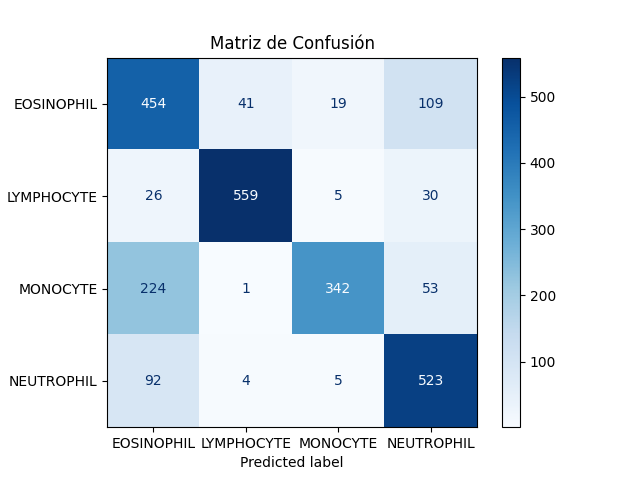

# Analizador Hematológico AI 
**(Web para probar el analizador: https://huggingface.co/spaces/AntonioMenor01/clasificador-celulas )**

Puede estar pausada si lleva mucho sin utilizarse.

## Introducción
Este proyecto utiliza **Deep Learning** para la clasificación automática de glóbulos blancos (leucocitos) a partir de imágenes de frotis de sangre. El modelo está basado en la arquitectura **MobileNetV2** y se despliega mediante una interfaz web interactiva.

##  Funcionalidades

* **Clasificación de 4 tipos celulares:** Eosinófilos, Linfocitos, Monocitos y Neutrófilos.
* **Interfaz Web:** Sistema de carga de imágenes con respuesta en tiempo real y visualización de confianza.
* **Entrenamiento Robusto:** Fine-tuning sobre MobileNetV2 con técnicas de *Data Augmentation* (rotación, zoom, giros).
* **Despliegue en la Nube:** Configurado para funcionar en **Hugging Face Spaces** mediante Docker.

## Estructura del Proyecto

```plaintext
blood_cell_classifier/
├── data/
│   ├── raw/                  # Dataset original (Train, Test, Test_Simple)
│   └── test_images/          # Imágenes de muestra para pruebas rápidas
├── models/
│   └── mobilenet_model.h5    # Modelo entrenado final (.h5)
├── src/                      # Código fuente (Lógica de Machine Learning)
│   ├── data_loader.py        # Generadores de datos y Augmentation
│   ├── model.py              # Arquitectura de la red neuronal
│   ├── train.py              # Script de entrenamiento
│   ├── evaluate.py           # Evaluación y generación de métricas
│   └── predict.py            # Script para predicción local manual
├── static/
│   └── index.html            # Interfaz de usuario 
├── results/                  
│   └── confusion_matrix.png  # Matriz de confusión generada
├── app.py                    # Servidor Flask (API y backend de la app)
├── environment.yml           # Configuración del entorno Conda
├── requirements.txt          # Dependencias para despliegue en nube
├── main.py                   # Orquestador principal del proyecto
└── Dockerfile                # Configuración de contenedor para la nube
```

##  Tecnologías Utilizadas

* **Python 3.11**
* **TensorFlow / Keras:** Construcción, fine-tuning y entrenamiento del modelo.
* **Flask / Flask-CORS:** Servidor web y gestión de peticiones entre dominios.
* **Pillow (PIL):** Procesamiento, redimensionado y carga de imágenes médicas.
* **NumPy:** Manipulación de matrices y datos numéricos.
* **HTML5 / CSS3 / JavaScript:** Interfaz de usuario con diseño moderno y barras de progreso.


## Instalación y Uso Local

1. **Clonar el repositorio:**
   ```bash
    git clone [https://github.com/AntonioMenor01/BloodCellsDetection](https://github.com/AntonioMenor01/BloodCellsDetection)
    cd blood_cell_classifier
   ```
2.  **Crear entorno virtual (Conda):**
    ```bash
    conda env create -f environment.yml
    conda activate RedNeuronalCelulas
    ```
3. **Ejecutar la aplicación web:**
   ```bash
    python app.py
   ```
Luego, abre en tu navegador: **http://127.0.0.1:5000**
    

## Detalles del Modelo
El modelo utiliza Transfer Learning sobre la base de MobileNetV2 (preentrenada en ImageNet). Para maximizar la precisión en imágenes médicas, se realizó un proceso de Fine-tuning:

* **Capas**:Se desbloquearon las últimas 50 capas del modelo base para su re-entrenamiento.

* **Optimizador**: Adam con un learning rate bajo ($1 \times 10^{-5}$) para un ajuste fino.

* **Regularización**: Capa Dropout al 30% y penalización $L2$ ($0.001$) en la última capa densa para evitar el sobreajuste.

*  **Loss**: Categorical Crossentropy.

## Resultados
La evaluación del modelo se centró en la diferenciación morfológica. Los resultados de precisión y pérdida se encuentran documentados en la carpeta ```/results```.

Matriz de Confusión: Permite observar el desempeño del modelo en cada una de las 4 clases, validando la baja tasa de falsos positivos entre clases similares (como Neutrófilos y Eosinófilos).


## Contacto
Proyecto desarrollado por Antonio - [antoniomenorflores.amf@gmail.com]
